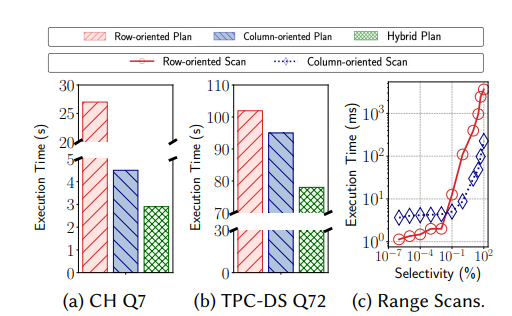
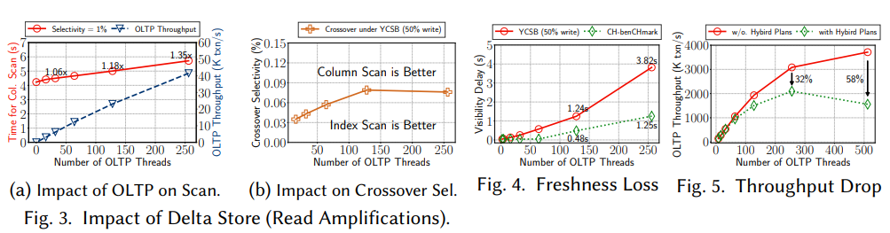
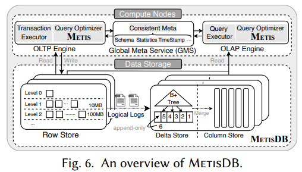
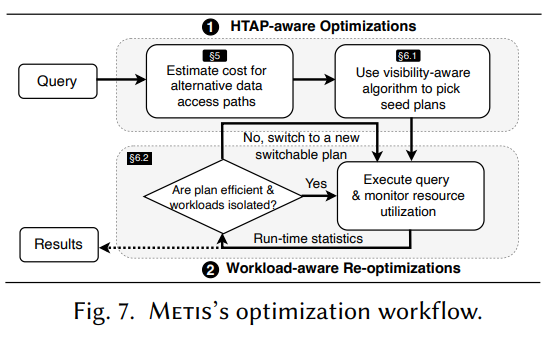

[Paper](https://haozesong.github.io/data/sigmod24-metis.pdf)

## 摘要

数据密集型应用的出现推动了HTAP的发展。为了支持混合负载，分布式 HTAP 数据库通常会维护两个专门针对数据新鲜度和性能隔离而设计的数据副本。具体而言，一份按行存储的数据副本适合 OLTP（联机事务处理）工作负载，而另一份按列存储的数据副本则针对 OLAP（联机分析处理）工作负载进行了优化。这种混合设计为查询优化打开了一个新的设计空间：查询计划可以在不同的数据格式之间进行优化，并在隔离的资源上执行，我们将其称为“混合计划（hybrid plans）”。在本文中，我们展示了混合计划在查询执行中可以带来显著收益（例如，在我们的评估中最多实现 11 倍的加速）。然而，我们也发现，这些收益可能以牺牲数据新鲜度或性能隔离为代价，因为传统优化器可能无法精确建模和调度在实时更新的 HTAP 数据库中执行的混合计划。为此，我们提出了一种 HTAP 感知的优化器——Metis。我们从理论和实验两个方面表明，采用所提出的优化技术，系统不仅可以大幅受益于混合计划，同时还能保持 OLTP 和 OLAP 的性能隔离，而且这些优化在面对工作负载变化时也具有鲁棒性。

<!--more-->

## HTAP中重要的两个特性

1. **数据新鲜度**
2. **性能隔离**：确保在某一类负载增加时，OLTP和OLAP的性能不会互相影响

## 挑战与解决方案

1. 如何在持续写入更新的情况下准确建模数据访问路径的成本？
   - 解决方案： 提出Demain（Delta-main model）成本模型，将数据动态性纳入考虑，可同时评估Delta表与列存表中select的性能，从而更高效地引导访问路径选择。
2. 如何在写入向列存异步传播时，平衡数据新鲜度与执行时间？
   - 在要求新鲜度的情况下，即使列存的扫描性能优于行存，也需要等待直到写入全部同步到缓存中。
   - 解决方案： 提出可见性感知的计划选择算法（visibility-aware plan selection algorithm），根据负载特性预测可见性延迟，优先在已有数据上预执行查询，从而掩盖延迟带来的性能瓶颈。
3. 在混合查询计划中，如何保证读写操作的性能隔离？
   - 一个简单方法是为OLAP设置读取限制。但这种固定配额方案缺乏灵活性，不同负载之间效果差异较大。
   - 解决方案： 提出了一种新的资源感知查询重优化方法（resource-aware query re-optimization）。区别于传统方法的资源调度和限制资源使用，该方法在检测到较高资源竞争时，会智能地重用之前优化过的子计划，将其中的高效子部分组合成一个新的查询计划。

## 贡献

1. 在一个流行类别的HTAP数据库中，针对使用多个专用数据副本的情况，系统性地分析了混合查询计划。
2. 开发了Metis，包括一个新的成本模型（Demain）、一个新的可见性感知的计划选择算法，以及一个新的查询计划重优化方法，以确保性能隔离。
3. 使用CH-benCHmark、TPC-DS和YCSB对Metis进行了广泛评估。评估结果表明，Metis能够生成高效的混合查询计划，并且这些计划对工作负载的变化具有鲁棒性。
4. Metis可以作为一个实际可行的模板，供未来在具有与MetisDB相同系统模型的HTAP数据库中采用HTAP感知查询优化方案参考使用。

## 背景

基于行存、列存的计划的执行时间：

- a、b表示基于行存、列存以及混合的查询计划的执行时间
- 混合计划是通过在行存储的成本模型中加入列存扫描作为一种可选的访问路径生成的
- c表示不同选择度（结果集在总数据占比）下行存、列存的执行时间

OLTP并发度增加造成的影响：

- 3a显示列扫描的执行时间随着OLTP并发度的增加而线性增长
- 3b显示选择度交叉点（selectivity crossover）随着OLTP并发度的增加而线性增长
  - 选择度大于交叉点的使用列存扫描更好
  - 选择度小于交叉的的使用基于索引的扫描更好
- 4显示P99.9新鲜度损失（更新时间与能够通过列存读取到的时间之差）随着OLTP并发度的增加而增加（文中：in ten seconds）
- 5显示TP吞吐随着OLTP并发度的改变

## Overview

### 总体架构

- shared-nothing的存算分离架构
- 使用RocksDB作为行存
- 使用ClickHouse作为列存
- 不考虑其他计算下推
- 通过逻辑日志同步
- 行存和delta表都使用mvcc

### 优化流程

- 流程：
  1. 收到查询优化请求后，根据成本模型和基数估计评估所有枚举的查询计划
  2. 去除较劣的计划，选择一个仅使用行存、一个仅使用列存、一个混合使用时最优的计划作为种子计划
  3. 从成本最低的种子计划开始执行，并实时监控查询性能和资源使用，验证统计估计
  4. 如果计划在执行过程中超出性能边界（如资源争用或估计误差），会拼接种子计划中的子计划生成新的执行计划
- 优点：
  1. 计划与执行交错进行
  2. 运行时可调整，适应数据动态变化
  3. 保证OLTP与OLAP性能隔离

## Demain模型

- 成本模型主要针对范围扫描
- Demain从四个维度对HTAP中的访问路径进行建模：
  - 查询
    - $sel$：查询的选择度
    - $w_{res}$：结果宽度（bytes per output tuple）
  - 数据集
    - $N$：元组数量
    - $ts$：元组长度
  - 硬件
    - $B_{net}$：网络带宽
    - $L_{net}$：网络延迟
    - $DB_{row}$：行存在硬盘的读带宽
    - $DB_{col}$：列存在硬盘的读带宽
    - $MB_{row}$：行存在内存的读带宽
    - $MB_{col}$：列存在内存的读带宽
    - $p$：CPU 频率的倒数
    - $f_{p}$：指令流水线因子
    - $f_{vec}$：向量化 OLAP 引擎因子
  - 存储
    - $T$：LSM读放大
    - $w_{a}$：字段宽度
    - $w_{id}$：RowID宽度
    - $b$：delta store中B+树的fanout（B+ 树中每个内部节点可以拥有的最大子节点数量）
    - $w_{k}$：索引中key的宽度
    - $N_{d}$：delta表大小
