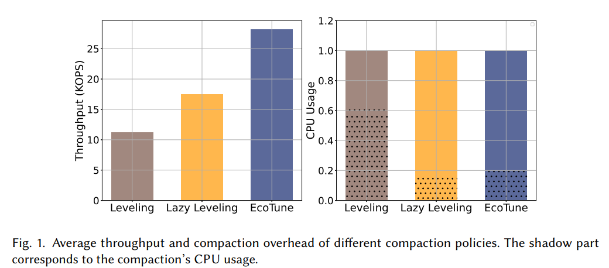

[Paper](https://dl.acm.org/doi/pdf/10.1145/3725344)

## 摘要

日志结构合并树 (LSM-trees) 被广泛应用于构建键值存储系统。它们会定期合并重叠的有序运行 (sorted runs) 以减少读取放大 (read amplification)。以往关于压缩 (compaction) 策略的研究主要集中在写入放大 (write amplification, WA) 和读取放大 (read amplification, RA) 之间的权衡。

在本文中，我们提出将 LSM-trees 中的压缩操作视为一种计算和 I/O 带宽投资，旨在提高系统未来的查询吞吐量，从而重新思考压缩策略的设计。典型的 LSM-tree 应用会处理稳定但中等的写入流，并优先为小规模有序运行的顶层刷新 (top-level flushes) 分配资源，以避免因写入停顿造成数据丢失。因此，压缩策略的目标是维护最佳数量的有序运行，以最大限度地提高平均查询吞吐量。

由于压缩和读取操作会争夺相同的 CPU 和 I/O 资源，我们必须进行联合优化，以确定压缩的适当时间和积极程度。我们引入了一个 LSM-tree 的三级模型，并提出了 EcoTune，这是一种基于动态规划的算法，可以根据工作负载特征找到最优的压缩策略。我们对 RocksDB 的评估表明，在具有范围/点查询比率的工作负载下，EcoTune 相较于分层 (leveling) 策略可将平均查询吞吐量提高 1.5 倍至 3 倍，相较于惰性分层 (lazy-leveling) 策略可提高高达 1.8 倍。

<!--more-->

## 简介和背景

以往的工作主要关注写放大和读放大的权衡，并认为写放大会导致低性能。实际上LSM树的写入流平稳且适度（写入速度不是很高）（Meta展示实际负载峰值45MB/s，远小于NVMe SSD提供的2GB/s带宽）。并且为了防止写停顿，会优先处理顶层的数据刷新。实验表明，将剩余的CPU和IO资源分配任意比例分配给压缩和查询都不会影响写入性能。因此，**压缩策略的目标是优化查询性能**，并且由于压缩操作和读取操作需要争夺相同的剩余 CPU 和 I/O 资源，因此需要联合优化。

以往的研究通常使用压缩操作刚完成后的最坏情况来建模查询性能。实际上读放大会随着排序段（sorted run，应该指排好序的一段）的数量变化而改变。因此应该看**平均查询吞吐量**指标而非瞬态的读放大指标。

> 实验：经典的 Leveling 策略相比 Lazy Leveling 策略具有更小的读放大（瞬态），但是查询吞吐量低，因为 Leveling 中的压缩操作消耗了超过一半原本可用于查询的 CPU 资源。
>
> 